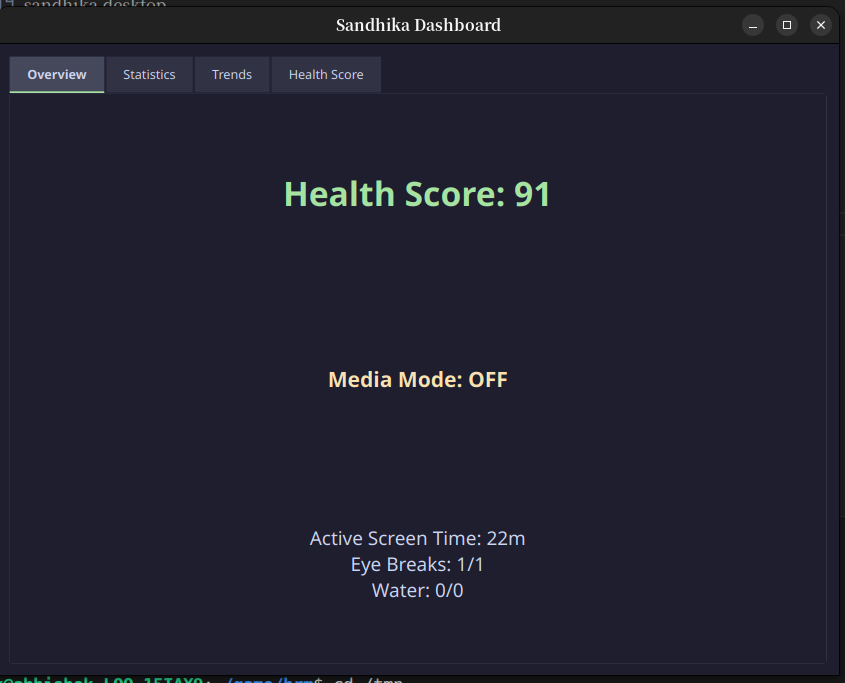
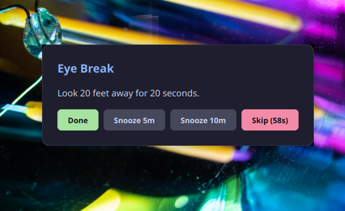
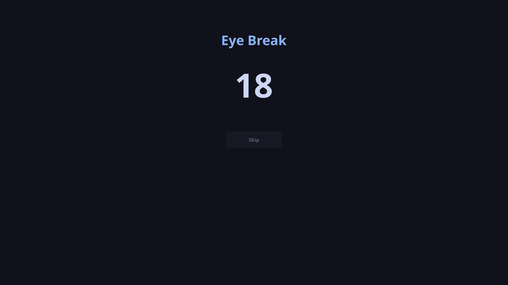
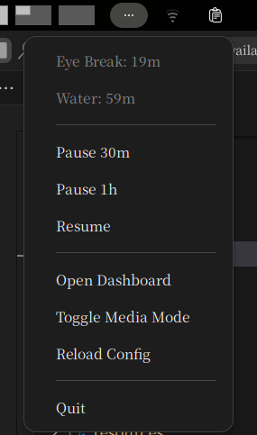
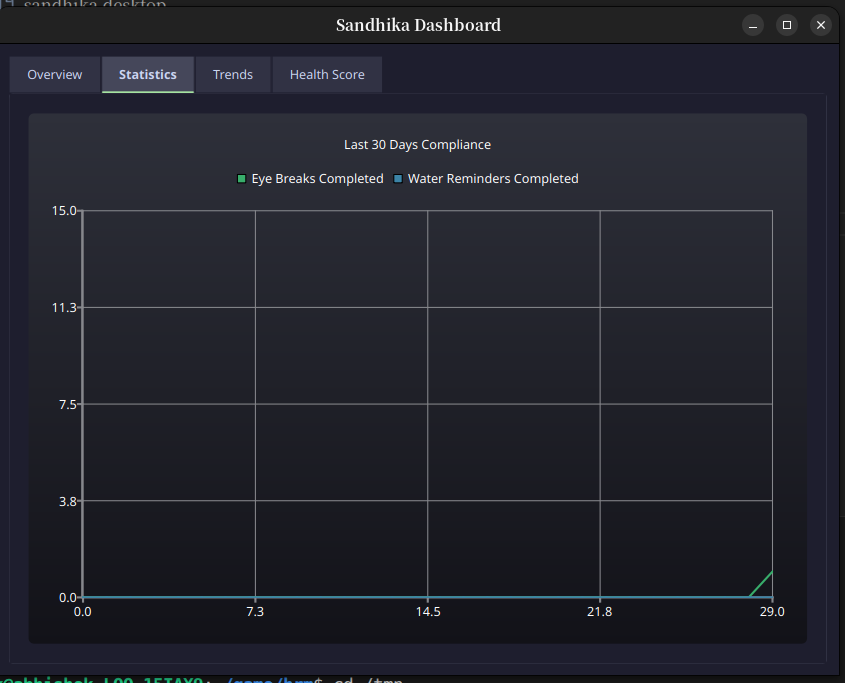
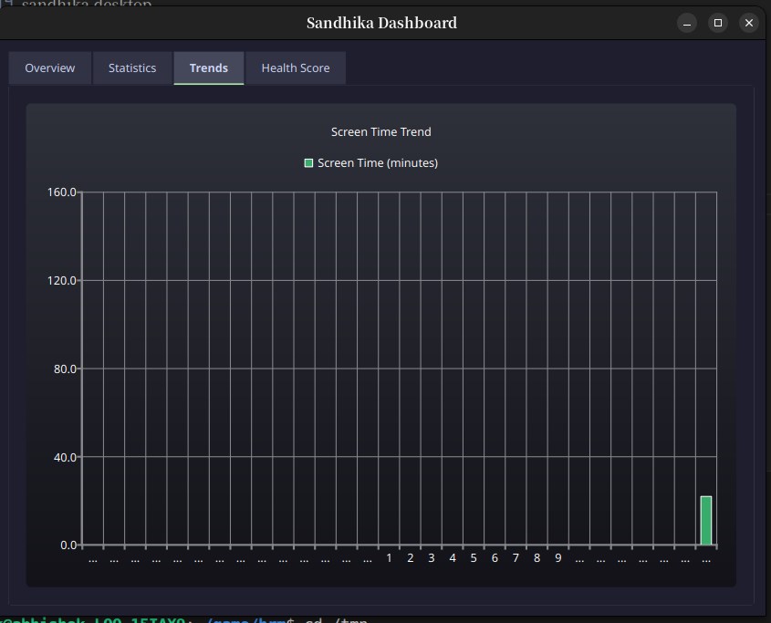

# Sandhika

A Qt6-based desktop application for Linux to remind you to take breaks, drink water, and maintain healthy habits.

## Documentation

- [Specification](./SPEC.md)
- [Configuration Guide](./config/config.example.yaml)
- [GitHub Releases](../../releases)
  
## Features

### Eye Breaks

* Configurable reminders
* Strict fullscreen break mode
* Brightness dimming
* Skip lock timer
* Countdown animation

### Water Reminders

* Periodic hydration reminders
* Snooze support
* Statistics tracking

### Custom Reminders

Supports:

* Interval reminders
* Daily reminders
* Weekly reminders
* Monthly reminders

Examples:

```yaml
- name: "Take Medicine"
  interval: 4h
  message: "Take your medicine"

- name: "Lunch"
  at: "13:00"
  message: "Take lunch"

- name: "Weekly Review"
  weekday: Sunday
  at: "18:00"
  message: "Review your weekly goals"

- name: "Pay Electricity Bill"
  day: 1
  at: "10:00"
  message: "Pay electricity bill"

- name: "Daily Standup"
  weekday: Monday
  at: "09:30"
  message: "Open standup dashboard"
  command: "xdg-open https://company.atlassian.net"

- name: "Check Emails"
  interval: 2h
  message: "Review important emails"
  command: "xdg-open https://mail.google.com"

- name: "Open Jira Board"
  at: "10:00"
  message: "Start today's tasks"
  command: "xdg-open https://company.atlassian.net/jira"

- name: "Log Work Hours"
  at: "18:00"
  message: "Update timesheet"
  command: "xdg-open https://company-timesheet.com"
```


### Dashboard

* Health Score
* Screen Time
* Eye Break Streaks
* Water Intake Trend
* 30 Day Charts

### System Tray

* Pause 30m
* Pause 1h
* Resume
* Reload Config
* Media Mode
* Open Dashboard

### Smart Suppression

* Idle detection
* Media mode
* Fullscreen movie suppression
* Gaming mode

---

## Screenshots

| Dashboard | Notification |
|-----------|-------------|
|  |  |

| Strict Break | Tray |
|-------------|------|
|  |  |

| Statistics | Trends |
|-----------|--------|
|  |  |

---

## Installation

### Option 1: Download AppImage 

Download the latest release from **GitHub Releases**.

Make it executable:

```bash
chmod +x Sandhika-x86_64.AppImage
```

Run:

```bash
./Sandhika-x86_64.AppImage
```

No installation or dependencies are required.

---

### Option 2: Install from Source (Recommended)

Clone the repository:

```bash
git clone https://github.com/Abhishek688Singh/Sandhika.git

cd Sandhika
```

Run the installer:

```bash
chmod +x install.sh

./install.sh
```

The installer will:

* Build Sandhika
* Install the binary to `~/.local/bin`
* Install the desktop entry
* Install the systemd user service
* Create configuration and data directories

---

### Add Sandhika to PATH

Add this line to your `~/.bashrc`:

```bash
export PATH="$HOME/.local/bin:$PATH"
```

Apply the changes:

```bash
source ~/.bashrc
```

Now you can run:

```bash
sandhika
```

from any terminal.

---

## Build from Source

### Requirements

```text
Qt6
Qt Charts
Qt Svg
yaml-cpp
cmake
g++
```

### Build

```bash
cmake -S . -B build -DCMAKE_BUILD_TYPE=Release

cmake --build build -j
```

---

## Run from Source

```bash
./build/sandhika
```

---

## CLI Commands

```bash
sandhika pause 30m

sandhika pause 1h

sandhika resume

sandhika reload

sandhika media on

sandhika media off

sandhika status
```

---

## Configuration

The configuration file is located at:

```text
~/.config/sandhika/config.yaml
```

If the file does not exist, Sandhika automatically creates it using the default configuration.

Edit:

```bash
nano ~/.config/sandhika/config.yaml
```

Reload configuration:

```bash
sandhika reload
```


## Configuration

Config file:

```text
~/.config/sandhika/config.yaml
```

A default config is created automatically if it does not exist.

---

## Full Documentation

See:

```text
SPEC.md
```

The specification contains:

* Architecture
* Module Design
* Scheduler
* Notification System
* Strict Break Window
* Dashboard
* Statistics
* YAML Schema
* AppImage Packaging
* Installation
* Future Roadmap

---

## Project Structure

```text
include/
src/
tests/
resources/
config/
systemd/
scripts/
```

---

## Technology Stack

* C++20
* Qt6 Widgets
* Qt Charts
* yaml-cpp
* CMake
* Linux AppImage

---

## License

MIT License
